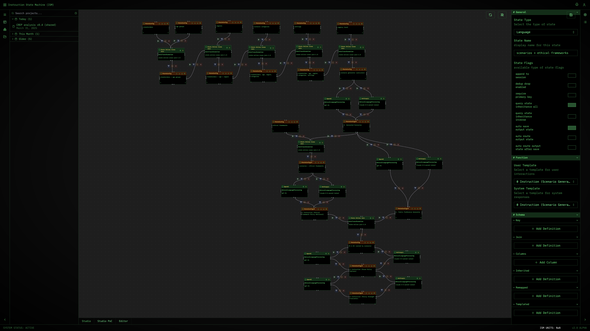

# Alethic Instruction-Based State Machine Studio UI (ISM)
Alethic ISM Studio is the web-based workbench for building, visualizing and running instruction-based state-machine workflows in real time. It connects to the core ISM components so you can design programmable pipelines and execute them interactively. Learn more on the Alethic ISM homepage.

Instructions can invoke code, query data, direct large language models, or perform structured transformations. Each node applies an instruction to an input state via a processor, producing a new, versioned, immutable output state. Together, these nodes form computable workflows that are fully executable, traceable and reproducible.

The system is experimental and is under active development as part of Bioethics with AI research supported by the University of Oxford and the National University of Singapore, with previous research support from Princeton University.

### Watch Tailwind (optional)
If you want tailwind updates to take effect during development run

`sh tailwind.sh`

### Start Dev Server

`npm start`

Opens at http://localhost:3000.

## License
Alethic ISM is under a DUAL licensing model, please refer to [LICENSE.md](LICENSE.md).

**AGPL v3**  
Intended for academic, research, and nonprofit institutional use. As long as all derivative works are also open-sourced under the same license, you are free to use, modify, and distribute the software.

**Commercial License**
Intended for commercial use, including production deployments and proprietary applications. This license allows for closed-source derivative works and commercial distribution. Please contact us for more information.

